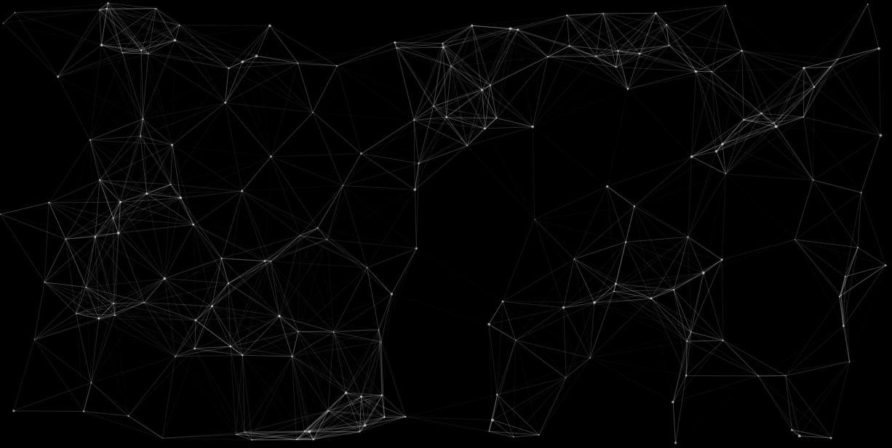
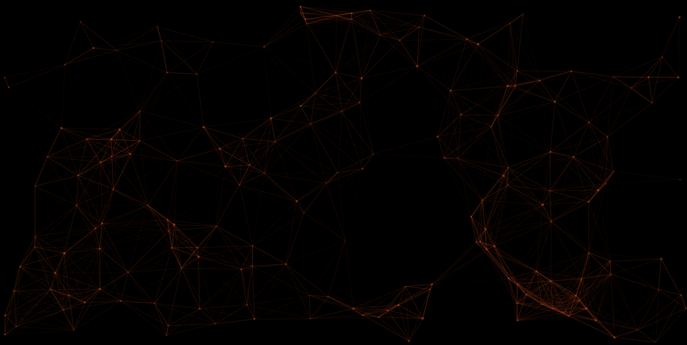
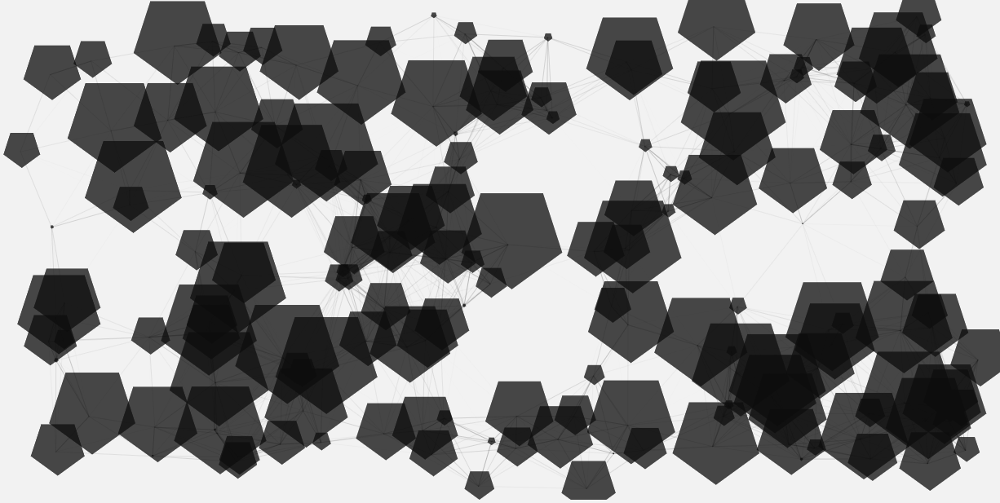
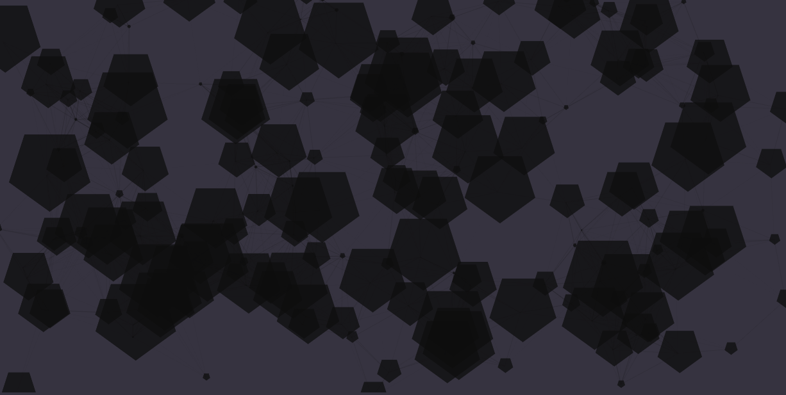
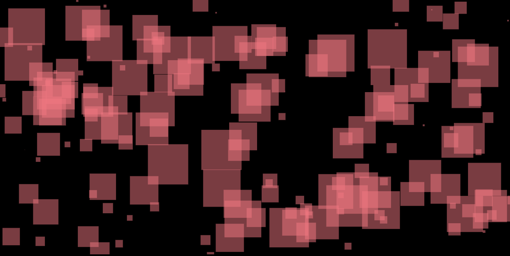
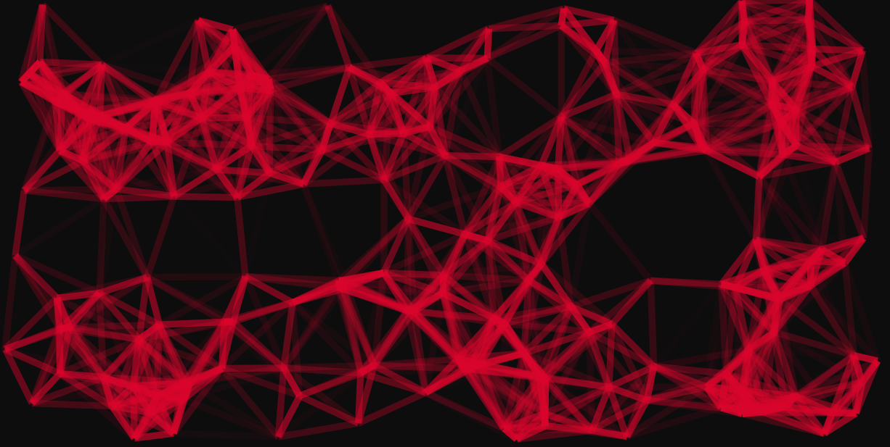
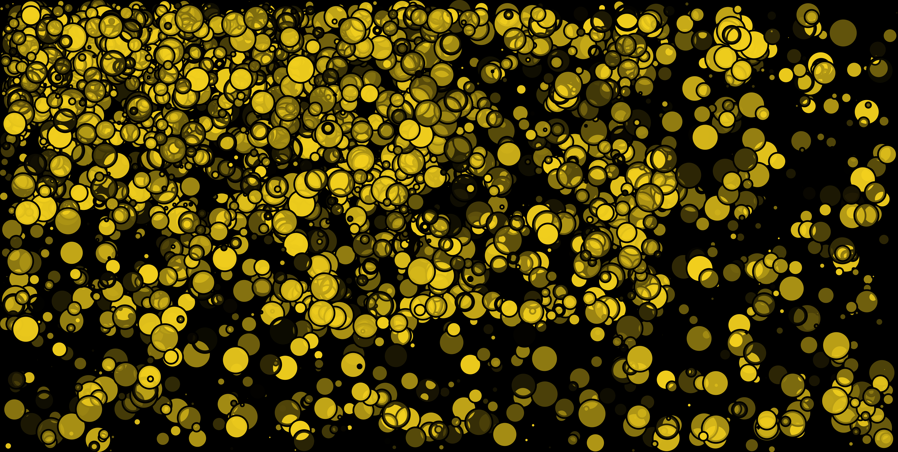

# Iota
Iota was built to generate images to use them in any place you want, and that's it.
You can view it [here](https://mohammedal-rowad.github.io/iota/).

## Examples

<details><summary>particles 1</summary>
<p>



</p>
</details>


<details><summary>particles 2</summary>
<p>



</p>
</details>

<details><summary>pentagons 1</summary>
<p>



</p>
</details>


<details><summary>pentagons 2</summary>
<p>



</p>
</details>


<details><summary>square</summary>
<p>



</p>

</details>


<details><summary>onyx 1</summary>
<p>



</p>
</details>


<details><summary>onyx 2</summary>
<p>


</p>
</details>

- to generate large images you can click (**Ctr** and **-**) to zoom out, then click generate (ps: refresh the page to get more distributed shapes)

<details><summary>onyx 3, if you decrease the page zoom you will get a really big image (this work in all shapes)</summary>
<p>


</p>
</details>


<details><summary>circles, if you decrease the page zoom you will get a really big image (this work in all shapes)</summary>
<p>



</p>
</details>


- **Right now there is 8 shapes you can select and modify.**

## Installation
```bash
$ git clone https://github.com/MohammedAl-Rowad/iota.git
$ cd iota
$ git checkout code
$ npm i
$ ng s # this will serve the app on http://localhost:4200
$ ng s --port=4321 # to change the port
```

## Technologies
It was built using these technologies
    - [Angular](https://angular.io) 8.2.
    - [Dom-to-image](https://github.com/tsayen/dom-to-image).
    - [node-uuid](https://github.com/kelektiv/node-uuid).
    - [particles.js](https://vincentgarreau.com/particles.js/).
    - [angular-particle](https://www.npmjs.com/package/angular-particle).
    - [file-saver](https://www.npmjs.com/package/file-saver).
    - [magic.css](https://github.com/miniMAC/magic)
    - [nes.css](https://nostalgic-css.github.io/NES.css/)
    - [utility-types](https://github.com/piotrwitek/utility-types)
    
## About
This is just a simple app that was built on a couple of days and could be optimized a lot, for example adding more options to the user to modify the shapes instead of a pre-defined shapes that he/she only changes the color of them.

However adding new particles.js configuration objects to add new shapes are pretty easy since the code is very simple.

so PR's are very welcomed.